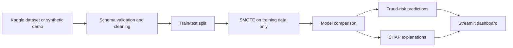

# PayGuard

**Explainable payment-fraud detection prototype with reproducible preprocessing, fraud-sensitive evaluation, SHAP explanations, testing, CI, and Docker.**

[](https://github.com/RidhanPar/payguard-ai-fraud-detection/actions/workflows/ci.yml)


[Open live dashboard](https://payguard-ai-fraud-detection.streamlit.app/) | [Read the model card](docs/MODEL_CARD.md) | [Deployment guide](docs/DEPLOYMENT.md)

PayGuard scores transaction fraud risk and explains model decisions through a Streamlit monitoring dashboard. It demonstrates leakage-aware preprocessing, class-imbalance handling, model comparison, batch and single-transaction prediction, and local/global SHAP explanations.

> **Scope:** this is a portfolio prototype built around the public Kaggle credit-card fraud dataset. Demo mode uses synthetic records matching that schema. It is not a production fraud decisioning system and must not be used for real customer decisions without validation, governance, monitoring, and human review.

## Reviewer Guide

| Capability | Evidence |
|---|---|
| Data validation and leakage-aware preprocessing | [`src/data_pipeline.py`](src/data_pipeline.py) |
| Fraud-sensitive model comparison | [`src/train.py`](src/train.py) |
| Batch and single-transaction scoring | [`src/predict.py`](src/predict.py) |
| SHAP explanations | [`src/explain.py`](src/explain.py) |
| Live stakeholder dashboard | [`streamlit_app.py`](streamlit_app.py), [`app/dashboard.py`](app/dashboard.py) |
| Automated tests and coverage gate | [`tests/`](tests/), [`.github/workflows/ci.yml`](.github/workflows/ci.yml) |
| Reproducible packaging and deployment | [`Dockerfile`](Dockerfile), [`docker-compose.yml`](docker-compose.yml) |

## Architecture



## Evaluation Approach

The repository intentionally does not publish unverified model scores. Run the preprocessing and training workflow on your local copy of the Kaggle dataset to reproduce the results.

Model selection reports:

- Precision, recall, F1, ROC-AUC, and PR-AUC.
- Logistic Regression baseline alongside Random Forest and XGBoost.
- Test-set evaluation kept separate from SMOTE-resampled training data.
- Preprocessing fitted on training data only.

For imbalanced fraud detection, PR-AUC, recall, precision, and false-positive cost are more informative than accuracy alone.

## Quick Start

```bash
git clone https://github.com/RidhanPar/payguard-ai-fraud-detection.git
cd payguard-ai-fraud-detection
python -m venv .venv
# Windows: .venv\Scripts\activate
# macOS/Linux: source .venv/bin/activate
pip install -r requirements.txt
pytest -q
streamlit run streamlit_app.py
```

The dashboard can launch in sample mode without the Kaggle file. To reproduce model training, download `creditcard.csv` from the [Kaggle Credit Card Fraud Detection dataset](https://www.kaggle.com/datasets/mlg-ulb/creditcardfraud) and place it in `data/raw/`.

```bash
python src/data_pipeline.py
python src/train.py
```

## Docker

```bash
docker build -t payguard .
docker run --rm -p 8501:8501 payguard
```

Or:

```bash
docker compose up --build
```

## Why This Project Does Not Use an LLM Agent

Fraud scoring and evaluation should be deterministic, reproducible, and auditable. Adding an LLM agent to the prediction path would not improve the core evidence in this repository. The portfolio's agentic-AI work is demonstrated separately in the AI Operations project, while PayGuard stays focused on explainable supervised machine learning.

## Repository Map

```text
app/          Streamlit product dashboard
src/          Preprocessing, training, prediction, explainability, utilities
tests/        Pipeline, prediction, explanation, and runtime tests
docs/         Model card, Docker, and deployment guidance
notebooks/    Supporting exploratory and modeling notebooks
```

## Production Boundary

Before real use, the system would need governed and representative data, time-based and segment-level validation, calibrated thresholds, model monitoring, fairness review, case-management integration, access controls, audit records, and human-review policy.

## Resume Bullet

Built a tested and containerized fraud-risk prototype using Python, XGBoost, SMOTE, SHAP, and Streamlit, with leakage-aware preprocessing, fraud-sensitive evaluation, and explainable single-transaction and batch scoring.
